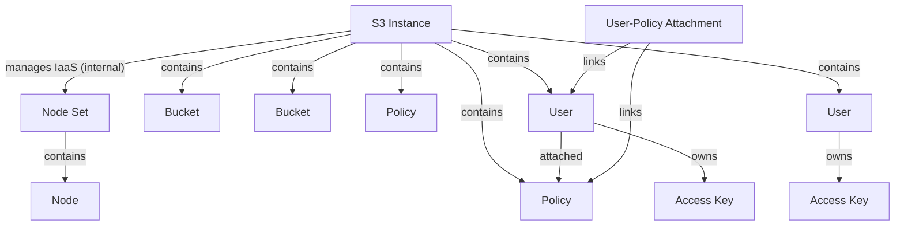

# Genesis S3

## Overview

Genesis S3 is an S3-compatible object storage service (S3aaS) built on top of RustFS. It provides scalable, managed object storage with bucket, policy, and user management via a REST API.

## Key Features

- S3-compatible API (RustFS)
- Bucket management with versioning, object lock, and public access
- Fine-grained IAM policies with user/access key separation
- Automatic infrastructure provisioning and reconciliation
- Multi-node support

## Architecture

The platform consists of:

- **Control Plane (CP)**: User API, orchestration API, PaaS/Infra builders
- **Data Plane (DP)**: RustFS instance on a VM, agent with reconciliation loop
- **Agent**: Syncs target state from CP to actual state on RustFS via admin API
